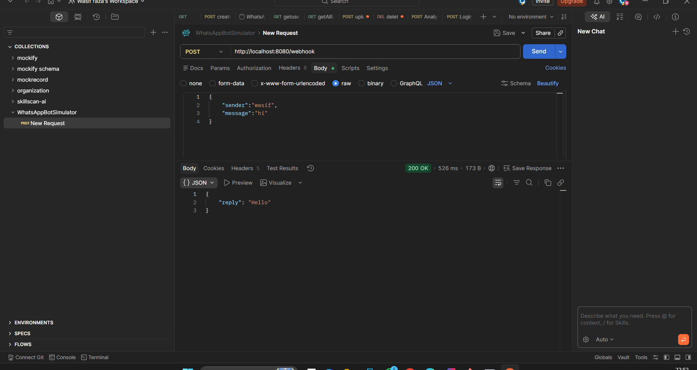
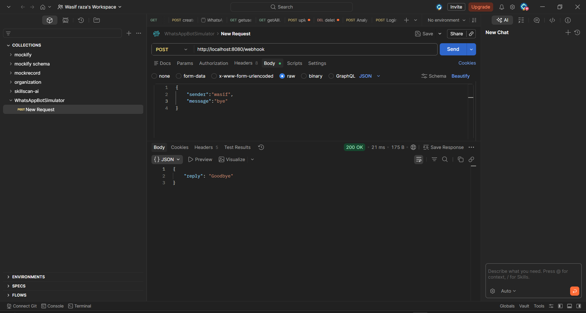
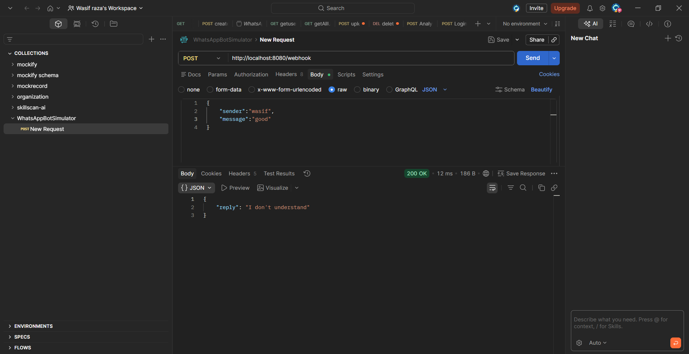

# WhatsApp Chatbot Simulator (Spring Boot)

A simple REST-based chatbot that simulates WhatsApp message handling.
It accepts JSON input via a webhook and responds with predefined replies.
The application is **stateless** and follows a **clean layered architecture with a service interface**.

---

##  Features

*  REST API endpoint `/webhook`
*  Accepts JSON messages (simulating WhatsApp)
*  Predefined replies:

  * `hi` → `Hello`
  * `bye` → `GoodBye`
*  Logs all incoming messages
*  Stateless design
*  Service Interface + Implementation (clean architecture)

---

##  Tech Stack

* Java 21 (LTS)
* Spring Boot 3.x
* Lombok
* REST API

---

##  Project Structure

```text id="c6x3mk"
src/main/java/com/chatbot/WhatsApp/Bot/Simulator
│
├── controller
│   └── WebhookController.java
│
├── dto
│   ├── request
│   │   └── UserMessageRequest.java
│   └── response
│       └── BotResponse.java
│
├── service
│   ├── ChatBotService.java        // Interface
│   └── impl
│       └── ChatBotServiceImpl.java // Implementation
│
└── WhatsAppBotSimulatorApplication.java
```

---


### Flow Explanation

1. Client sends POST request → `/webhook`
2. Controller receives JSON request
3. Message is logged
4. Controller calls **Service Interface**
5. Implementation class processes the message
6. Reply is generated
7. Response returned to client

---

## API Endpoint

### POST `/webhook`

**Request Body:**

```json id="c0a9p2"
{
  "sender": "wasif",
  "message": "hi"
}
```

**Response:**

```json id="qz5l1p"
{
  "reply": "Hello"
}
```

---

##  Logging

Example log:

```id="l2h8zv"
Received message from wasif: hi
```

---

##  Chatbot Logic (Service Implementation)

```java id="y6dp7f"
switch (msg) {
            case "hi":
                return "Hello";
            case "bye":
                return "Goodbye";
            default:
                return "I don't understand";
        }
```

---

##  Configuration

### `application.yml`

```yaml id="8x4p2m"
server:
  port: 8080

logging:
  level:
    root: INFO
```

---

##  Testing (Postman)

* Method: `POST`
* URL: `http://localhost:8080/webhook`
* Header:

  ```
  Content-Type: application/json
  ```
* Body:

```json id="w8nq4v"
{
  "sender": "user1",
  "message": "hi"
}
```

---

### Screenshots








##  Conclusion

This project demonstrates a clean and scalable Spring Boot chatbot using:

* REST API
* Service Interface pattern
* Stateless architecture

---
